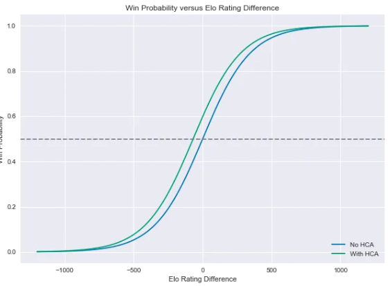

```{r setup, include=FALSE}
knitr::opts_chunk$set(echo = TRUE)
```

```{r}
# Libraries
library(elo)
library(tidyverse)
library(mosaic)
```

```{r}
# Data
Season.19.20 <- read.csv('C:/Users/Ryan/Desktop/SDSFinalProject/Final Project/Basketball-Reference-19-20/Games/Season-19-20.csv', header=TRUE)
```


## Introduction

As a result of the COVID-19 virus, many events are being cancelled or postponed with uncertainty. Many businesses are also closing or shutting down. Unfortunately, this means the precious American tradition of sports is consequently impacted by this situation. As you probably know, pretty much all major sports seasons have been cancelled including the MLB, NBA, NCAA, and even the 2020 Little League World Series, this year being the first time it has not been held since it began in 1947. This is the case for many athletic events as we continue through these unprecedented times. Being the huge basketball fans we are (Go Rockets!), we decided to take matters into our own hands. As much as we will miss the NCAA MArch Madness Tournament (incuding Texas' chance in making it) as well as the NBA playoffs, it does not mean we cannot get an idea as to how some of these games might have played out. With that said, for our final project we will be performing some data analysis on some NBA data to draw some conclusions about the 2019-2020 NBA season, including how it might have possibly ended.

## Predicting the 2019-2020 NBA Season

Since we missed one of the most exciting times of the year (NBA Playoffs & Finals), we will attempt to make some predictions on how the rest of the season might have played out using a popular system referred to as Elo Ratings. This tool, created by Arpad Elo (a Hungarian-American physics professor), was orginally created to rate chess players, but is now used for all sorts of competitions ranging anywhere from sports to video games. This is a methodology that FiveThirtyEight, and many other sports analysts take advantage of due to its simplicity and effectiveness. 

These ratings depend only on the final score of each game and where it was played (home-court advantage). In other words, this system is built on a Win/Loss basis. We will be analyzing the 2018-2019 NBA Season in its entirety to validate its performance, then we will apply it to the 2019-2020 regular season in order to predict the matchups for the playoffs, finals, and ultimately the NBA Champions. For this project, we pulled a lot of data, including game-by-game scores, from Basketball-Reference.com. 

#### How does Elo work?

The long-run average for an Elo score in the NBA sits around 1500. An Elo of 1500 means that the teams performance would normally distrubuted around an average of 1500 with the chance of performing better or worse. The formula for Elo below shows how the probability of one team beating another is calculated using the ratings

When Player A competes in a match against Player B, Player A has an expected outcome (probability or score) for team A (EA). Where RA = Rating for team A and RB = Rating for team B; The expected outcome for team A (EA) can be calculated by the formula below:

$\begin{aligned}  \textrm{EA} & = \frac{1}{1 + 10^{\frac{(Rb-Ra)}{400}}}  \end{aligned}$

The same calculation (EB) has to be done for Player B, but with RA (current rating A) and RB (current rating B) swapped so that EA + EB = 1. Once the match is played and SA (actual outcome or score for team A), and SB (actual outcome or score for team B) are determined, R’ A (New rating for A) and R’ B (New rating for A) are calculated with the formula below:

$R′A=RA+K(SA−EA)$

The S value in our case would either be 1 for a win, or 0 for a loss (since their are no ties in the NBA).

Where K is an optimization constant that usually take different values according the sport and the amount of games available. This is basically the maximum amount by which a score can change in one match. If K is set too high, the ratings will jump around too much; if it’s set too low, Elo will take too long to recognize important changes in team quality. Determining the right value of K is an entirely different and more complicated subject, so for this experiment we will be using K=20, the optimal K for the NBA determined by FiveThirtyEight. This is higher than most other sports, probably because the NBA plays more games and is subject to relatively little randomness. 

Home-court advantage is set as equivalent to 100 Elo rating points. One hundred Elo points is equivalent to about 3.5 NBA points, so that’s like saying the home team would be favored by 3 or 4 points if the teams were otherwise evenly matched (obviously this value fluctuates from season to season). Since the team plays about half of their games at home and the other half away, a change in the home-court advantage value does not produce a significant difference in the ratings, but is still important to consider.

Elo strikes a nice balance between ratings systems that account for margin of victory and those that don’t. While teams always gain Elo points after wins and lose Elo points after losses, they gain or lose more with larger margins of victory.

This works by assigning a multiplier to each game based on the final score and dividing it by a team’s projected margin of victory conditional upon having won the game. For instance, the Warriors’ 4-point margin over the Rockets in Game 1 of the 2018-2019 Western Conference finals was lower than Elo would expect for a Warriors win. So the Warriors gain Elo points, but not as many as if they’d won by a larger margin. The formula accounts for diminishing returns; going from a 5-point win to a 10-point win matters more than going from a 25-point win to a 30-point win. For the exact formula, see the footnotes.2

Instead of resetting each team’s rating when a new season begins, Elo carries over a portion of a team’s rating from one season to the next. In NBA ratings, three-quarters of the previous score are kept. The high fraction reflects the fact that NBA teams are more consistent from year to year. For example, the Miami Heat ended the 2012-13 NBA season with an Elo rating of 1754. The team’s Elo rating for the start of the 2013-14 season is calculated as follows: $(.75 * 1754) + (.25 * 1500) = 1692$ This is how we will initialize the ELo scores for the 2019-2020 NBA Season.

So after incorporating a constant for home court advantage, our formula is as follows with A=100 points (the value we previously determined represetns a home-court advantage):

$\begin{aligned}  P(\textrm{Home team wins}) & = \frac{1}{1 + 10^{-\frac{(H-R+A)}{400}}}.  \end{aligned}$

This is an example of a logistic function:


#### The 2018-2019 NBA Season


