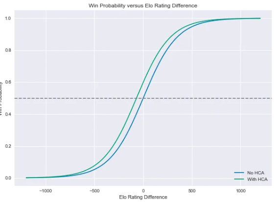

```{r setup, include=FALSE}
knitr::opts_chunk$set(echo = TRUE)
```

```{r include=FALSE}
# Libraries
library(elo)
library(tidyverse)
library(mosaic)
library(ggplot2)
library(foreach)
```

```{r include=FALSE}
# Data
Season.19.20 <- read.csv('./data/Basketball-Reference-19-20/Games/Season-19-20.csv', header=TRUE)
Remaining.Games.19.20 <- read.csv('./data/nba-remaining-games-2019-2020.csv', header=TRUE)
```


# Abstract


# Introduction

Due to the widespread impact of COVID-19 throughout the world, almost every company, organization, and public event has canceled or suspended any activities that involve interpersonal contact for the forseeable future. Many of these activities are moving to a virtual format if possible, but several others have been forced to shut down.

As avid sports fans, the absence of the major sporting events during this time has hit us and many others around the world especially hard [1]. Some of the events that we particularly were looking forward to include the NBA, NCAA March Madness tournament, MLB, and the 2020 Summer Olympics.

In our curiosity, we decided to utilize this opportunity to exercise our data science and modeling skills in order to predict what could have been. Specifically, we focused on the NBA and the NBA Playoffs. Since the 2019-20 NBA season was suspended approximately one month prior to the end of the regular season (and the beginning of the playoffs), we used the 2019-20 season data accumulated from the games played before the suspension to predict how the season and the playoffs would have ended had everything gone according to schedule.

In this analysis, we will examine data from the 2019-20 NBA season as well as some data from previous NBA seasons in order to draw some meaningful conclusions about the remainder of the 2019-20 NBA season.


# Predicting the 2019-20 NBA Season

Since we missed one of the most exciting times of the year (the NBA Playoffs & Finals), we made some predictions on how the rest of the season might have played out using a popular methodology referred to as the Elo ratings system [2]. This tool, created by Hungarian-American physics professor Arpad Elo, was orginally designed to rate chess players, but is now used for all sorts of competitions ranging anywhere from sports to video games. This is a methodology that FiveThirtyEight and many other popular sports analysts take advantage of due to its simplicity and effectiveness [3].

These ratings depend only on the final score of each game as well as where it was played (home-court advantage). In other words, this system is built on a Win/Loss basis. We will be analyzing the 2018-19 NBA Season in its entirety to validate its performance, then we will apply it to the 2019-20 regular season in order to predict the matchups for the Playoffs and the Finals and ultimately the NBA Champions. For this project, we retrieved several types of data sources including game-by-game scores and schedules for several seasons from Basketball-Reference.com [4].


## How does Elo work?

The long-run average for an Elo score in the NBA sits around 1500. An Elo of 1500 means that the teams performance would be normally distrubuted around an average of 1500 with the chance of performing better or worse. The formula for Elo below shows how the probability of one team beating another is calculated using the ratings.

When Player $A$ competes in a match against Player $B$, Player $A$ has an expected outcome (probability or score) for Team $A$ ($E[A]$) where $R_A$ is the rating for Team $A$ and $R_B$ is the rating for Team $B$. The expected outcome for Team $A$ ($E[A]$) can be calculated by the formula below:

$$
E[A] = \frac{1}{1 + 10^{\frac{(R_B-R_A)}{400}}}
$$

The same calculation ($E[B]$) has to be done for Player $B$, but with $R_A$ (current rating $A$) and $R_B$ (current rating $B$) swapped so that $E[A] + E[B] = 1$. Once the match is played and $S_A$ (actual outcome or score for Team $A$) and $S_B$ (actual outcome or score for Team $B$) are determined, $R^{\prime}_A$ (the new rating for $A$) and $R^{\prime}_B$ (the new rating for $A$) are calculated with the formula below:

$$
R^{\prime}_A=R_A+K(S_A-E[A])
$$

The $S$ value in our case would either be 1 for a win, or 0 for a loss. This is because there are no ties in the NBA.

In this equation, $K$ is an optimization constant that usually takes different values according the sport and the amount of games available. In other words, this value is the maximum amount by which a score can change in one match. If $K$ is set too high, the ratings will jump around too much; if $K$ is set too low, Elo will take too long to recognize important changes in team quality. Determining the right value of K is an entirely different and more complicated topic, so for this experiment we will be using $K=20$, the optimal $K$ for the NBA determined by FiveThirtyEight [3]. This is higher than most other sports and can likely be attributed to the fact that the NBA plays more games (81 games per team) and is subject to relatively little randomness.

Home-court advantage is set as equivalent to 100 Elo rating points. One hundred Elo points is equivalent to about 3.5 NBA points, so it can also be interpreted as the home team being favored by 3 to 4 points if the teams were otherwise evenly matched (obviously this value fluctuates from season to season). Since every team plays about half of their games at home and the other half away, a change in the home-court advantage value does not produce a significant difference in the ratings, but is still an important factor to consider.

Elo strikes a nice balance between ratings systems that account for margin of victory and those that do not. While teams always gain Elo points after wins and lose Elo points after losses, they also gain or lose more with larger margins of victory.

This works by assigning a multiplier to each game based on the final score and dividing it by a team’s projected margin of victory conditional upon having won the game. For instance, the Golden State Warriors' 4-point margin over the Houston Rockets in Game 1 of the 2018-19 Western Conference finals was lower than Elo would expect for a Warriors win. So the Warriors gain Elo points, but not as many as if they’d won by a larger margin. The formula accounts for diminishing returns; going from a 5-point win to a 10-point win matters more than going from a 25-point win to a 30-point win. For the exact formula, see the footnotes.

Instead of resetting each team’s rating when a new season begins, Elo carries over a portion of a team’s rating from one season to the next. This is to account for any momentum that a team may build from season-to-season (i.e. sports dynasties). In NBA ratings, three-quarters of the previous score are kept. The high fraction reflects the fact that NBA teams are more consistent from year to year. For example, the Miami Heat ended the 2012-13 NBA season with an Elo rating of 1754. The team’s Elo rating for the start of the 2013-14 season is calculated as follows:

$$
(0.75 * 1754) + (0.25 * 1500) = 1692
$$

Since this is a consistent method, we will also initialize the Elo scores for the 2019-20 NBA Season using the Elo scores from the 2018-19 season.

After incorporating a constant for home court advantage, our formula is as follows with $A=100$ points (the value we previously determined represetns a home-court advantage):

$$
P(\mbox{Home team wins}) = \frac{1}{1 + 10^{-\frac{(H-R+A)}{400}}}
$$

This is an example of a logistic function:

```{r echo=FALSE, out.width='100%', fig.width = 8, fig.height = 5, fig.align='center', out.width='.49\\linewidth', fig.show='hold', comment=NA, warning=FALSE}

```

## The 2018-19 NBA Season


# References

[1] List of all sporting events canceled around the world during the coronavirus pandemic (https://www.espn.com/olympics/story/_/id/28824781/list-sporting-events-canceled-coronavirus)

[2] Elo ratings system (https://en.wikipedia.org/wiki/Elo_rating_system)

[3] FiveThirtyEight NBA Elo Ratings (https://fivethirtyeight.com/features/how-we-calculate-nba-elo-ratings/)

[4] Compilation of in-depth NBA statistics (https://www.basketball-reference.com/)