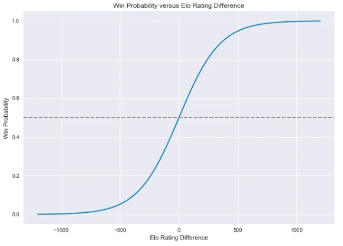
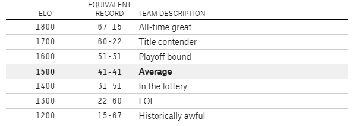

```{r setup, include=FALSE}
knitr::opts_chunk$set(echo = TRUE, fig.pos = 'H')
```

```{r libraries, include=FALSE}
library(elo)
library(tidyverse)
library(mosaic)
library(ggplot2)
library(foreach)
library(data.table)
library(magrittr)
library(dplyr)
library(stringr)
library(elo)
library(rvest)
library(lubridate)
library(cluster)
library(FNN)
library(glmnet)
library(knitr)
```

```{r data, include=FALSE}
season2016_2017 = read.csv('./data/nba-scrape-data-2016-2017.csv', header=TRUE)
season2017_2018 = read.csv('./data/nba-scrape-data-2017-2018.csv', header=TRUE)
season2018_2019 = read.csv('./data/nba-scrape-data-2018-2019.csv', header=TRUE)
season2019_2020 = read.csv('./data/nba-scrape-data-2019-2020.csv', header=TRUE)
remaining_games_19_20 <- read.csv('./data/nba-remaining-games-2019-2020.csv', header=TRUE)
player_stats = read.csv('./data/nba_19-20_player_stats.csv', header=TRUE)
```


# Abstract

The COVID-19 pandemic has affected our society in various ways and has changed numerous events on schedule for 2020. One such event that we were looking forward to was the end of the 2019-20 NBA season as well as the 2020 NBA Playoffs. Since a large portion of the 2019-20 NBA regular season games have already been played, we utilized the data collected from these games to calculate Elo ratings for each team in order to predict the standings for 2019-20 as well as the matchups and results of the Playoffs. From our analysis, we found that ... **[NEED TO ADD MORE HERE]**.


# Introduction

Due to the widespread impact of the COVID-19 pandemic throughout the world, almost every company, organization, and public event has canceled or suspended any activities that involve interpersonal contact for the forseeable future. Many of these activities are moving to a virtual format if possible, but several others have been forced to shut down.

As avid sports fans, the absence of the major sporting events during this time has hit us and many others around the world especially hard [1]. Some of the events that we particularly were looking forward to include the NBA, NCAA March Madness tournament, MLB, and the 2020 Summer Olympics.

In our curiosity, we decided to utilize this opportunity to exercise our data science and modeling skills in order to predict what could have been. Specifically, we focused on the NBA and the NBA Playoffs. Since the 2019-20 NBA season was suspended approximately one month prior to the end of the regular season (and the beginning of the playoffs), we used the 2019-20 season data accumulated from the games played before the suspension to predict how the season and the playoffs would have ended had everything gone according to schedule.

In this analysis, we will examine data from the 2019-20 NBA season as well as some data from previous NBA seasons in order to draw some meaningful conclusions about the remainder of the 2019-20 NBA season.


# Methods


## Predicting the 2019-20 NBA Season Standings

Since we missed one of the most exciting times of the year (the NBA Playoffs & Finals), we made some predictions on how the rest of the season might have played out using a popular methodology referred to as the Elo ratings system [2]. This tool, created by Hungarian-American physics professor Arpad Elo, was orginally designed to rate chess players, but is now used for all sorts of competitions ranging anywhere from sports to video games. This is a methodology that FiveThirtyEight and many other popular sports analysts take advantage of due to its simplicity and effectiveness [3].

These ratings depend only on the final score of each game as well as where it was played (home-court advantage). In other words, this system is built on a Win/Loss basis. We will be analyzing the 2018-19 NBA Season in its entirety to validate its performance, then we will apply it to the 2019-20 regular season in order to predict the matchups for the Playoffs and the Finals and ultimately the NBA Champions. For this project, we retrieved several types of data sources including game-by-game scores and schedules for several seasons from Basketball-Reference.com [4].


### How does Elo work?

The long-run average for an Elo score in the NBA sits around 1500. An Elo of 1500 means that the teams performance would be normally distrubuted around an average of 1500 with the chance of performing better or worse. For more detail, Figure \ref{fig:elo_chart} (Appendix) shows what an Elo rating tells us about a team and how it can convey the teams overall season record. A higher Elo rating indicates that the team has a high win-loss ratio and is more likely to play deeper into the season.

The formula for Elo below shows how the probability of one team beating another is calculated using the ratings. When Player $A$ competes in a match against Player $B$, Player $A$ has an expected outcome (probability or score) for Team $A$ ($E[A]$) where $R_A$ is the rating for Team $A$ and $R_B$ is the rating for Team $B$. The expected outcome for Team $A$ ($E[A]$) can be calculated by the formula below:

$$
E[A] = \frac{1}{1 + 10^{\frac{(R_B-R_A)}{400}}}
$$

The same calculation ($E[B]$) has to be done for Player $B$, but with $R_A$ (current rating $A$) and $R_B$ (current rating $B$) swapped so that $E[A] + E[B] = 1$. Once the match is played and $S_A$ (actual outcome or score for Team $A$) and $S_B$ (actual outcome or score for Team $B$) are determined, $R^{\prime}_A$ (the new rating for $A$) and $R^{\prime}_B$ (the new rating for $A$) are calculated with the formula below:

$$
R^{\prime}_A=R_A+K(S_A-E[A])
$$

The $S$ value in our case would either be 1 for a win, or 0 for a loss. This is because there are no ties in the NBA.

In this equation, $K$ is an optimization constant that usually takes different values according the sport and the amount of games available. In other words, this value is the maximum amount by which a score can change in one match. If $K$ is set too high, the ratings will jump around too much; if $K$ is set too low, Elo will take too long to recognize important changes in team quality. Determining the right value of K is an entirely different and more complicated topic, so for this experiment we will be using $K=20$, the optimal $K$ for the NBA determined by FiveThirtyEight [3]. This is higher than most other sports and can likely be attributed to the fact that the NBA plays more games (81 games per team) and is subject to relatively little randomness.

Home-court advantage is set as equivalent to 100 Elo rating points. One hundred Elo points is equivalent to about 3.5 NBA points, so it can also be interpreted as the home team being favored by 3 to 4 points if the teams were otherwise evenly matched (obviously this value fluctuates from season to season). Since every team plays about half of their games at home and the other half away, a change in the home-court advantage value does not produce a significant difference in the ratings, but is still an important factor to consider.

Elo strikes a nice balance between ratings systems that account for margin of victory and those that do not. While teams always gain Elo points after wins and lose Elo points after losses, they also gain or lose more with larger margins of victory.

This works by assigning a multiplier to each game based on the final score and dividing it by a team’s projected margin of victory conditional upon having won the game. For instance, the Golden State Warriors' 4-point margin over the Houston Rockets in Game 1 of the 2018-19 Western Conference finals was lower than Elo would expect for a Warriors win. So the Warriors gain Elo points, but not as many as if they’d won by a larger margin. The formula accounts for diminishing returns; going from a 5-point win to a 10-point win matters more than going from a 25-point win to a 30-point win. For the exact formula, see the footnotes.

Instead of resetting each team’s rating when a new season begins, Elo carries over a portion of a team’s rating from one season to the next. This is to account for any momentum that a team may build from season-to-season (i.e. sports dynasties). In NBA ratings, three-quarters of the previous score are kept. The high fraction reflects the fact that NBA teams are more consistent from year to year. For example, the Miami Heat ended the 2012-13 NBA season with an Elo rating of 1754. The team’s Elo rating for the start of the 2013-14 season is calculated as follows:

$$
(0.75 * 1754) + (0.25 * 1500) = 1692
$$

Since this is a consistent method, we will also initialize the Elo scores for the 2019-20 NBA Season using the Elo scores from the 2018-19 season.

After incorporating a constant for home court advantage, our formula is as follows with $A=100$ points (the value we previously determined represents a home-court advantage):

$$
P(\mbox{Home team wins}) = \frac{1}{1 + 10^{-\frac{(H-R+A)}{400}}}
$$

```{r elo_logit, echo=FALSE, out.width='100%', fig.width = 8, fig.height = 5, fig.align='center', out.width='.49\\linewidth', fig.cap="\\label{fig:logit}Logistic Function of Win Probability by Elo Rating Difference", comment=NA, warning=FALSE}

```

In Figure \ref{fig:logit}, we see an example of a logistic function for win probability by Elo rating difference.


## Predicting the 2019-20 NBA Season Award Winners

Another interesting part of any NBA season is the awards given to the players and teams based on their regular season performances. Some key awards that catch headlines every year include Most Valuable Player (MVP), Defensive Player of the Year (DPOY), and Rookie of the Year (ROY). In addition to predicting the end-of-season standings, we decided that any analysis of the remainder of the 2019-20 NBA season would be incomplete unless it discussed award winners in the major categories. In particular, we sought to predict the MVP and 

In order to predict award winners at the end of the season, we needed to predict the leaders of some of the crucial statistical categories at the end of the season. To predict these players, we analyzed some significant statistics and identified the optimal regression model to predict these statistics. Some of the statistics we utilized in building this model include true shooting percentage (TS), total rebound percentage (TRB), usage percentage (USG), and assist percentage (AST) among 22 total recorded categories.

Accordingly, we examined different types of regression models in order to identify which type of model best predicted some of the major statistics. These include win shares (WS), value over replacement player (VORP), player efficiency rating (PER), offensive box plus/minus (OBPM), and defensive box plus/minus (DBPM).

To identify the best prediction model, we first predicted WS from the current 2019-20 season statistics using 4 different regression models: linear, lasso, ridge, and logistic. We measured the performance of every model with the actual WS values for each player using RMSE (root mean squared error) to determine which had the least error with smaller RMSE values indicating higher accuracy. In order to reduce Monte Carlo variability, we used 200 repeated random samples of the data for each model to find the true RMSE values.

We then used this to predict the MVP and DPOY by looking at the leaders at the end of the season in WS, VORP, PER, OBPM, and DBPM because these categories carried significant weighting in determing the respective awards.


```{r calculate_elo, include=FALSE}
nbateams <- data.frame(team=union(season2019_2020$home_team_name, season2019_2020$visitor_team_name))
nbateams <- nbateams %>% mutate(elo=1500)
nbateams

historical_elo <- data.frame(team = nbateams$team)
historical_elo <- historical_elo %>% mutate(elo=1500)

head(season2019_2020)
season2019_2020$home_team_wins

#Copy and paste season data.frame into loop (seq and match) to update elo for consecutive seasons
for (i in seq(nrow(season2019_2020))) {
  match <- season2019_2020[i, ]
  
  #Pre-match ratings
  teamA_elo <- subset(nbateams, team==match$home_team_name)$elo
  teamB_elo <- subset(nbateams, team==match$visitor_team_name)$elo
  
  #Update our ratings
  new_elo <- elo.calc(wins.A = match$home_team_wins,
                      elo.A = teamA_elo,
                      elo.B = teamB_elo,
                      k = 20)
  
  #Results reported as data.frame
  #Team A's new rating in row1/column1
  #Team B's new rating in row1/column2
  new_elo
  teamA_new_elo <- new_elo[1,1]
  teamB_new_elo <- new_elo[1,2]
  
  #Update the ratings for Teams A and B and leave other teams as they were
  nbateams <- nbateams %>%
    mutate(elo = if_else(team==match$home_team_name, teamA_new_elo,
                         if_else(team==match$visitor_team_name, teamB_new_elo, elo)))
}

options(digits=8)

nbateams %>%
  arrange(-elo)

avg_season_elo = 1505

nbateams <- nbateams %>% mutate(elo=0.75*elo+.25*avg_season_elo)

nbateams <- nbateams %>%
  arrange(-elo)

names(nbateams)[names(nbateams) == "team"] <- "Team"
names(nbateams)[names(nbateams) == "elo"] <- "Elo Rating"
```

```{r elo_ratings, fig.pos = "H", echo=FALSE, comment=NA}
kable(list(nbateams[1:15,], nbateams[16:30,]), caption = "Elo Ratings for Every NBA Team (Descending)")
```

```{r regression_models, include=FALSE}
player_stats <- data.frame(player_stats)
player_stats <- player_stats[!(player_stats$Tm=="TOT"),]
player_stats <- player_stats[(player_stats$G>=25 & player_stats$MP>=1200),]


# rmse function
rmse = function(y, yhat) {
  sqrt(mean((y - yhat)^2, na.rm=TRUE))
}

# variables that control how long the program takes to run
num_splits = 200
#k_limit = 20

#model 1: linear regression model (RMSE)
#80% training data, 20% test data
n = nrow(player_stats)
n_train = round(0.8*n)  # round to nearest integer
n_test = n - n_train

#200 different random splits
lm_vals = do(num_splits)*{
  
  # re-split into train and test cases with the same sample sizes
  train_cases = sample.int(n, n_train, replace=FALSE)
  test_cases = setdiff(1:n, train_cases)
  on_train = player_stats[train_cases, 6:27]
  on_test = player_stats[test_cases, 6:27]
  
  linearModel = lm(WS ~ (. - WS.48 - OWS - DWS), data=on_train)
  linearModelInteractions = lm(WS ~ (. - WS.48 - OWS - DWS)^2, data=on_train)
  
  # Predictions out of sample + convert to binary
  y_test = predict(linearModel, on_test)
  y_test_2 = predict(linearModelInteractions, on_test)
  
  c(rmse(y_test, on_test$WS),rmse(y_test_2, on_test$WS))
}
lm_avg = unname(colMeans(lm_vals))
lm_avg


#models 2,3: lasso regression/ridge regression (RMSE)
vals_lr_rr = do(num_splits)*{
  
  # re-split into train and test cases with the same sample sizes
  train_cases = sample.int(n, n_train, replace=FALSE)
  test_cases = setdiff(1:n, train_cases)
  on_train = player_stats[train_cases, 6:27]
  on_test = player_stats[test_cases, 6:27]
  
  temp_train = model.matrix.lm(WS ~ (. - WS.48 - OWS - DWS), data = on_train, na.action=na.pass)
  temp_test = model.matrix.lm(WS ~ (. - WS.48 - OWS - DWS), data = on_test, na.action=na.pass)
  x_train = temp_train[complete.cases(temp_train),]
  y_train = on_train$WS[complete.cases(temp_train)]
  x_test = temp_test[complete.cases(temp_test),]
  y_test = on_test$WS[complete.cases(temp_test)]
  
  # lasso regression
  cv_fit_l = cv.glmnet(x_train, y_train, family="gaussian", alpha = 1)
  # ridge regression
  cv_fit_r = cv.glmnet(x_train, y_train, family="gaussian", alpha = 0)
  
  opt_lambda_l = cv_fit_l$lambda.min
  opt_lambda_r = cv_fit_r$lambda.min
  
  y_pred_l = predict(cv_fit_l$glmnet.fit, s = opt_lambda_l, newx = x_test)
  y_pred_r = predict(cv_fit_r$glmnet.fit, s = opt_lambda_r, newx = x_test)
  
  c(rmse(y_pred_l, y_test), rmse(y_pred_r, y_test))
}
lr_model_avg = min(vals_lr_rr[,1])
rr_model_avg = min(vals_lr_rr[,2])
lr_model_avg
rr_model_avg


#model 4: logistic regression
vals_logm = do(num_splits)*{
  # re-split into train and test cases with the same sample sizes
  train_cases = sample.int(n, n_train, replace=FALSE)
  test_cases = setdiff(1:n, train_cases)
  on_train = player_stats[train_cases, 6:27]
  on_test = player_stats[test_cases, 6:27]
  
  logitModel = glm(WS ~ (. - WS.48 - OWS - DWS), data=on_train, family=gaussian, maxit = 100)
  logitModelInteractions = glm(WS ~ (. - WS.48 - OWS - DWS)^2, data=on_train, family=gaussian, maxit = 100)
  
  # Predictions out of sample + convert to binary
  y_test = predict(logitModel, on_test)
  y_test_2 = predict(logitModelInteractions, on_test)
  
  c(rmse(y_test, on_test$WS), rmse(y_test_2, on_test$WS))
}
logm_vals = unname(colMeans(vals_logm))
```

```{r reg_model_rmse, include=FALSE, comment=NA, warning=NA}
cat("MODEL SUCCESS:")
cat("1) LINEAR REGRESSION MODEL (without interactions) - RMSE:", lm_avg[1])
cat("1) LINEAR REGRESSION MODEL (with interactions) - RMSE:", lm_avg[2])
cat("2) LASSO REGRESSION - RMSE:", lr_model_avg[1])
print("coefficients for lasso regression:")
print(coef(cv_fit_l$glmnet.fit,s = cv_fit_l$lambda.min))
cat("3) RIDGE REGRESSION - RMSE:", rr_model_avg[1])
#print("coefficients for ridge regression:")
#print(coef(cv_fit_r$glmnet.fit,s = cv_fit_r$lambda.min))
cat("4) LOGISTIC REGRESSION (without interactions) - RMSE:", logm_vals[1])
cat("4) LOGISTIC REGRESSION (with interactions) - RMSE:", logm_vals[2])
```

```{r pred_stat_leaders, echo=FALSE, fig.width = 3, fig.height = 2, fig.align='center', out.width='.49\\linewidth', fig.show='hold', fig.cap="\\label{fig:pred_stat_leaders}End-of-Season Predicted Stat Leaders with Logistic Regression Model", comment=NA, warning=FALSE}
train_cases = sample.int(n, n_train, replace=FALSE)
test_cases = setdiff(1:n, train_cases)
on_train = player_stats[train_cases, 6:27]
on_test = player_stats[test_cases, 6:27]


logitModelWS = glm(WS ~ (. - WS.48 - OWS - DWS), data=on_train, family=gaussian, maxit = 100)

predicted_WS = predict(logitModelWS, player_stats[,6:27])

predictions_WS <- data.frame(player_stats$Player, predicted_WS)
predictions_WS <- predictions_WS %>%
  arrange(-predicted_WS)
#head(predictions_WS)

names(predictions_WS)[names(predictions_WS) == "player_stats.Player"] <- "Player"
names(predictions_WS)[names(predictions_WS) == "predicted_WS"] <- "Predicted WS"

#kable(predictions_WS[1:5,], caption = "Predicted WS Leaders for 2019-20")


logitModelVORP = glm(VORP ~ (. - WS - WS.48 - OWS - DWS), data=on_train, family=gaussian, maxit = 100)

predicted_VORP = predict(logitModelVORP, player_stats[,6:27])

predictions_VORP <- data.frame(player_stats$Player, predicted_VORP)
predictions_VORP <- predictions_VORP %>%
  arrange(-predicted_VORP)
#head(predictions_VORP)

names(predictions_VORP)[names(predictions_VORP) == "player_stats.Player"] <- "Player"
names(predictions_VORP)[names(predictions_VORP) == "predicted_VORP"] <- "Predicted VORP"

#kable(predictions_VORP[1:5,], caption = "Predicted VORP Leaders for 2019-20")


logitModelPER = glm(PER ~ (. - WS - WS.48 - OWS - DWS), data=on_train, family=gaussian, maxit = 100)

predicted_PER = predict(logitModelPER, player_stats[,6:27])

predictions_PER <- data.frame(player_stats$Player, predicted_PER)
predictions_PER <- predictions_PER %>%
  arrange(-predicted_PER)
#head(predictions_PER)

names(predictions_PER)[names(predictions_PER) == "player_stats.Player"] <- "Player"
names(predictions_PER)[names(predictions_PER) == "predicted_PER"] <- "Predicted PER"

#kable(predictions_PER[1:5,], caption = "Predicted PER Leaders for 2019-20")


logitModelOBPM = glm(OBPM ~ (. - WS - WS.48 - OWS - DWS - BPM), data=on_train, family=gaussian, maxit = 100)

predicted_OBPM = predict(logitModelOBPM, player_stats[,6:27])

predictions_OBPM <- data.frame(player_stats$Player, predicted_OBPM)
predictions_OBPM <- predictions_OBPM %>%
  arrange(-predicted_OBPM)
#head(predictions_OBPM)

names(predictions_OBPM)[names(predictions_OBPM) == "player_stats.Player"] <- "Player"
names(predictions_OBPM)[names(predictions_OBPM) == "predicted_OBPM"] <- "Predicted OBPM"

#kable(predictions_OBPM[1:5,], caption = "Predicted OBPM Leaders for 2019-20")


logitModelDBPM = glm(DBPM ~ (. - WS - WS.48 - OWS - DWS - BPM), data=on_train, family=gaussian, maxit = 100)

predicted_DBPM = predict(logitModelDBPM, player_stats[,6:27])

predictions_DBPM <- data.frame(player_stats$Player, predicted_DBPM)
predictions_DBPM <- predictions_DBPM %>%
  arrange(-predicted_DBPM)
#head(predictions_DBPM)

names(predictions_DBPM)[names(predictions_DBPM) == "player_stats.Player"] <- "Player"
names(predictions_DBPM)[names(predictions_DBPM) == "predicted_DBPM"] <- "Predicted DBPM"

#kable(predictions_DBPM[1:5,], caption = "Predicted DBPM Leaders for 2019-20")


kable(list(predictions_WS[1:5,], predictions_VORP[1:5,], predictions_PER[1:5,], predictions_OBPM[1:5,], predictions_DBPM[1:5,]), caption = "End-of-Season 2019-20 Predicted Stat Leaders with Logistic Regression Model")
```

# Results


**[Tables, figures, and text that illustrate your findings. Keep the focus on the numbers here. You will interpret your results in the next section.]**


First, we calculated the Elo ratings for each team for the games played so far in the 2019-20 season. As explained earlier, we incorporated 25% of the previous season's Elo ratings with 75% of this season's current Elo ratings. Table 1 shows the Elo ratings we derived for each team when the NBA season was suspended.  ... **[NEED TO ADD MORE HERE]**

After simulating how the 2019-20 NBA season and Playoffs would have ended, we tested several regression models to determine the best model to predict end-of-season WS. By testing linear, lasso, ridge, and logistic regression models, found that the lasso model provided the lowest RMSE value (`r lr_model_avg[1]`) with the linear model (`r lm_avg[1]`) and logistic models (`r logm_vals[1]`) providing slightly higher RMSE values.

Then, we predicted the season leaders for the various principal categories of WS, VORP, PER, OBPM, and DBPM. We utilized a logistic regression model for predicting the stat leaders due to its relative simplicity and clarity. We verified that this logistic regression model was appropriate by measuring its RMSE values and plotting actual vs. predicted for each category for the current 2019-20 season data (Figure \ref{fig:pred_stat_plots}). These plots verify that the predicted stats fall within a very small margin of the actual stats and thus have small residual values.

Using these accumulated season statistics, we determined the end-of-season statistics by updating each player's stats based on their team, schedule matchups, and usage percentage. We updated the statistics to arrive at the end-of-season statistics using these factors because a player's team and schedule can heavily influence their output and their usage percentage indicates how heavily their team relies on that specific player (which correlates to more playing time).

The final season stat leaders for each of the categories is shown in Table 2. We verified these predictions by limiting the qualifiers for each category and comparing with each player's previous performance history. We narrowed the pool of players down by only considering players with more than 25 games played and 1200 minutes played because this reflects the criteria that the NBA Season Awards use to nominate qualifying players. By inspecting the top five players in each category, we notice several household names and early season favorites for MVP and DPOY including Giannis Antetokounmpo, James Harden, LeBron James, and Anthony Davis.

```{r echo=FALSE, fig.width = 5, fig.height = 3, fig.align='center', out.width='.49\\linewidth', fig.show='hold', fig.cap="\\label{fig:pred_stat_plots}End-of-Season Predictions of Key Statistics with Logistic Regression Model", fig.pos = "H", comment=NA, warning=FALSE}
ggplot() +
  geom_point(data=player_stats[,6:27],aes(x = WS, y = predicted_WS ), color="black") + 
  geom_line(data=player_stats[,6:27],aes(x = WS, y = WS ), color="red") + 
  xlab("Actual WS") + 
  ylab("Predicted WS") + 
  ggtitle("Actual WS vs. Predicted WS")

ggplot() +
  geom_point(data=player_stats[,6:27],aes(x = VORP, y = predicted_VORP ), color="black") + 
  geom_line(data=player_stats[,6:27],aes(x = VORP, y = VORP ), color="red") + 
  xlab("Actual VORP") + 
  ylab("Predicted VORP") + 
  ggtitle("Actual VORP vs. Predicted VORP")

ggplot() +
  geom_point(data=player_stats[,6:27],aes(x = PER, y = predicted_PER ), color="black") + 
  geom_line(data=player_stats[,6:27],aes(x = PER, y = PER ), color="red") + 
  xlab("Actual PER") + 
  ylab("Predicted PER") + 
  ggtitle("Actual PER vs. Predicted PER")

ggplot() +
  geom_point(data=player_stats[,6:27],aes(x = OBPM, y = predicted_OBPM ), color="black") + 
  geom_line(data=player_stats[,6:27],aes(x = OBPM, y = OBPM ), color="red") + 
  xlab("Actual OBPM") + 
  ylab("Predicted OBPM") + 
  ggtitle("Actual OBPM vs. Predicted OBPM")

ggplot() +
  geom_point(data=player_stats[,6:27],aes(x = DBPM, y = predicted_DBPM ), color="black") + 
  geom_line(data=player_stats[,6:27],aes(x = DBPM, y = DBPM ), color="red") + 
  xlab("Actual DBPM") + 
  ylab("Predicted DBPM") + 
  ggtitle("Actual DBPM vs. Predicted DBPM")
```


# Conclusion

**[Interpret what you found. What are the main lessons we should take away from your report?]**


# Shortcomings/Drawbacks


# Appendix

```{r echo=FALSE, out.width='100%', fig.width = 8, fig.height = 5, fig.align='center', out.width='.49\\linewidth', fig.cap="\\label{fig:elo_chart}Breakdown of Elo Rating", comment=NA, warning=FALSE}

```


# References

> [1] List of all sporting events canceled around the world during the coronavirus pandemic (https://www.espn.com/olympics/story/_/id/28824781/list-sporting-events-canceled-coronavirus)


> [2] Elo ratings system (https://en.wikipedia.org/wiki/Elo_rating_system)


> [3] FiveThirtyEight NBA Elo Ratings (https://fivethirtyeight.com/features/how-we-calculate-nba-elo-ratings/)


> [4] Compilation of in-depth NBA statistics (https://www.basketball-reference.com/)


> [5] Elo Ratings for NBA Teams (http://practicallypredictable.com/2018/04/15/elo-ratings-for-nba-teams/#more-1019)